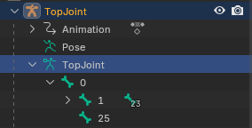
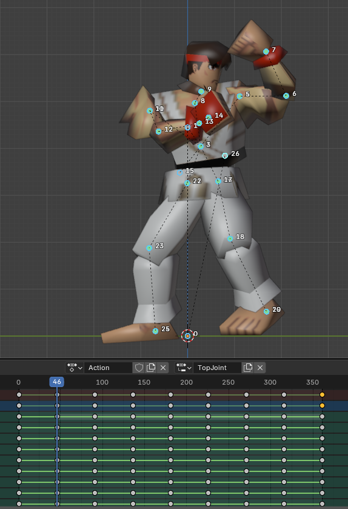

# Shield Pose

Shield pose requires some extra steps to make work correctly. It's not fun but also not impossible.

This guide is based on [Fray's notes on shield animations](shieldpose/notes_on_shield_animations.txt){:target="_blank"}. It's recommended to also read through his guide before starting.

## ShieldOn, ShieldOff

Create your shieldOn and shieldOff animations and import over your character. Keep default flags (`0xA0000000`).

**Place the last bone where the shield will be**: The last frame of your shieldOn animation will be used for the neutral shield pose.

| Animation | Frames (Blender) | Duration (Blender) |
|-|-|-|
| shieldOn | 1-5 | 4 |
| shieldOff | 1-13 | 12 |

## Preparations for the shield pose file

The shield pose is its own file with its own rig. This rig has 1 extra root bone compared to your character rig.

- Open your shieldOn animation in your 3d editor, clean up to only have the last frame
- Start from the last bone renaming all to `bone+1`. So if your last bone is 25, change it to 26. The last edit will be bone `0→1`.
- Create a new bone without any transforms and name it `0`.
- Make `0` parent of `1` (your old `0`). So now you have a new root bone.
- Get the last bone (grab bone, which is the shield position) and change parent from `1` to `0`

Your structure should look like this:

<figure markdown="span">
    
    <figcaption></figcaption>
</figure>

For all shield pose imports, use this new base.

## Base shield pose

Delete all model parts from your file (save as a new file!) and export your model as `shield_base.fbx`.
So this should be just the final frame of shieldOn but with the modified bone structure.

## Angled shield poses

Using the modified bone structure, we have to create 8 FBX files. Each one is 1/8 of the 360 degree rotation you can do while shielding.

```
1. Right → Top-right
2. Top-right → Top
3. Top → Top-left
4. Top-left → Left
5. Left → Bottom-left
6. Bottom-left → Bottom
7. Bottom → Bottom-right
8. Bottom-right → Right
```

Start by animating the 8 keyframes as listed. Each section must have 45 frames. So you'll have keyframes at 1, 46, 91...

Fray made an [interactive graph to calculate shield positions](https://www.desmos.com/calculator/hgtwj1sty1) that follows Smash 64's shield angle positions.

<figure markdown="span">
    
    <figcaption>This is the second position, Top-right.<br/>Here, bone 26 is my shield position bone.<br/>Do not add extra frames in any section.</figcaption>
</figure>

After you have your animation ready, let's export (save a backup!):

- Delete all sections leaving only one of them. For example, 1-46 for the first file.
- Export as FBX. Name each FBX from 1 to 8 while you go for each part.
    
    > If using Blender, uncheck "Add Leaf Bones" and under Animation set Sampling Rate to 45. This will make it so the exported file has only the 2 frames we want, without extra frames in-between.

## Importing

Here you're expected to have already imported your shieldOn and shieldOff animations.

- In GE, open your character's shield pose file
- Click on `Import Different Rig` and import your `shield_base.fbx` (base shield pose)
- On the bottom right, on the Special Parts, you'll start with `Misc 00` selected. Click on `Import from Obj If Added` and import `shield_base.fbx` (base shield pose) again.

Now, note that in the Misc Part selection we have `Misc 1..8`. These are the shield angles.

- Select `Misc 01`. Click on `Edit tracks`.
- Click on `Reset all commands` to delete everything that's there.
- By the bottom part, click on `Import Animation from .obj`. Import the correspondent fbx file for section 1.
- Close the window, and you can cancel both save prompts that might open up.
- Repeat the process for all 8 parts.

# Other notes

### Files

- Note that shieldOn and shieldOff might have different `Internal File Table Offsets`.
- Editing the shield pose changes things in the characters' `main` file.
    - In the `main` file, the shield pose is listed at 0x2D8..0x2F8. It's a linked list with 9 entries.
    - This linked list has entries in the format `XXXXYYYY`, where `XXXX * 4` is the address of the next entry in the list, and `YYYY` is the data.
    - If your `main` file is not synced with your shield pose, you can copy the **data** of all entries from a working `main` file to the new `main` file to make it work with the shield pose.

### Issues

- If your shield pose is too large (should be around 30 kB or so) it means your section files had extra frames other than the first and last. I think this can lead to the game not loading at all, too.
- If at any point of shielding the shield position or the model itself gets rotated, you have some extra rotation on bone 0 or the model object itself. Check that, re-export and re-import what you changed.
- If you model's parts "explode" ingame, it means you didn't edit the bone structure properly or accidentally used the unedited one.